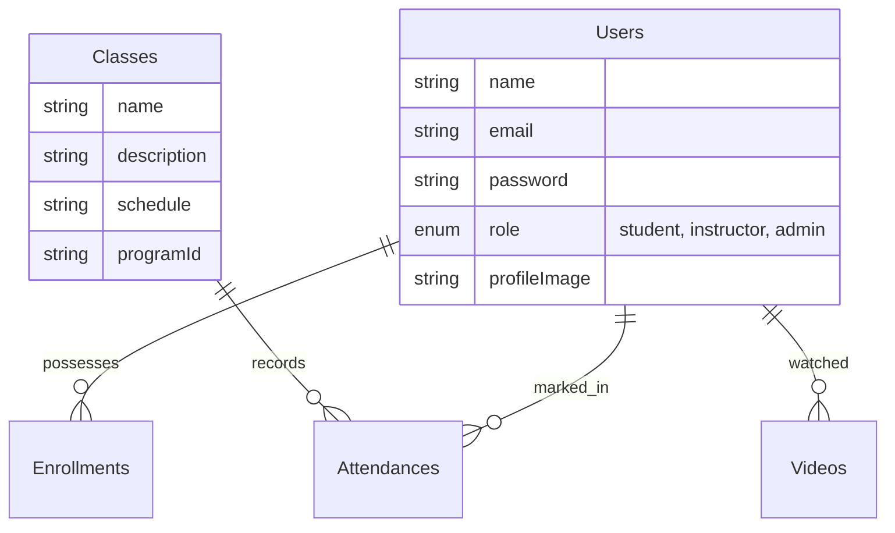

# Nritya Shakti Academy - Developer Technical Architecture Documentation

This comprehensive document serves as the master guide for any developer looking to understand, scale, or maintain the **Nritya Shakti Academy** learning management system.

---

## 1. High-Level System Overview
The application is structured as a monolithic frontend combined with a dedicated RESTful Node.js backend. 

### Technology Stack
**Frontend Ecosystem**
- **Framework:** React.js (v19) bundled using Vite 8.
- **Styling:** TailwindCSS alongside pure local CSS globals.
- **Routing:** React Router v7 DOM bindings.
- **Animations:** Framer Motion (page transitions, infinite scrolling carousels).
- **Network / API Calls:** Axios wrapped generally in try/catch blocks.

**Backend Ecosystem**
- **Core Server:** Node.js powered by Express v5.
- **Database:** MongoDB queried via Mongoose v9 ODM.
- **Authentication:** Dual-stack utilizing local JWT strategies (`jsonwebtoken`) and Google OAuth 2.0 (`google-auth-library`).
- **File Management & Generative:** Handled by Multer, PDFKit, and `@google/generative-ai` integrations.

---

## 2. Component Diagram & Routing Flow (Frontend)

The frontend initiates at `index.html` executing `main.tsx`. `App.tsx` controls the central `BrowserRouter`.

- **Public Routes:**
  - `/`, `/about`, `/classes`, `/programs/:id`
  - `/login`, `/register` (Managed via a single `AuthPage.tsx` switching states)
- **Protected Dashboards:** (Determined dynamically by `AuthContext.tsx` payload token `user.role`)
  - `/student` -> `StudentDashboard.tsx`
  - `/instructor` -> `InstructorDashboard.tsx`
  - `/admin` -> `AdminDashboard.tsx`

> **Note on Navigation:** `Navbar.tsx` manages mobile responsiveness independently and dynamically updates based on the local session token context stored via LocalStorage.

---

## 3. Database Schema Mapping (Backend)

The backend database operates primarily with six interconnected Mongoose models.

### Critical Database Workflows:
1. **User Schema (`models/User.js`):** Contains extensive tracking metrics for "Student" roles, including `classesCompleted`, `progress` metrics, and dynamically nested `certificateFiles`. Hashing utilizes `bcryptjs`.
2. **Attendance Management:** `Attendance.js` tracks daily presence. The Admin dashboard can instantly push attendance to any user bypassing the instructor constraint through dynamic REST controllers mapping to `Classes`.

---

## 4. Key Developer Features

### 4.1 Generative AI Integration
An AI Chatbot (`AIChatBot.tsx`) connects contextually to `@google/generative-ai` in the backend. It answers domain-specific Academy questions natively.

### 4.2 Automated PDF Certification (`certificateController.js`)
When an admin or instructor finalizes a course, the Node backend actively constructs a verified PDF certificate using `PDFKit`, embeds a cryptographically unique QR Code via `qrcode` wrapper, uploads it directly into a student's profile context, and makes it available securely on the `StudentDashboard.tsx`.

### 4.3 Automated Mailers (`sendEmail.js`)
Handles secure Forgot Password / OTP pipelines leveraging `nodemailer`. Features full transactional rollback on SMTP failures protecting the `resetOtpExpiry` tokens.

---

## 5. Visual Asset Gallery Overview

Below is the compilation of our core visual aesthetics built natively into the deployment environment:

### Core Logo Entity

### Landing Page Aesthetics
The home page renders cinematic elements, specifically combining the `Masterclass Performance` assets with dynamically overlaid cultural assets like *Lord Ganesha*:

### Thematic Program Images
Images mapped directly inside the intricate `DanceProgramsCarousel.tsx` logic map handling mobile-desktop scroll scaling:

### Administrative Headshots
Lead instructor imagery mapped within the `AboutUs` and Home contexts:

---

## Conclusion

This architecture sets a durable, highly scalable, and exceptionally fast ecosystem, combining cutting-edge frontend glassmorphism standards with hardcore authenticated NodeJS performance flows.
